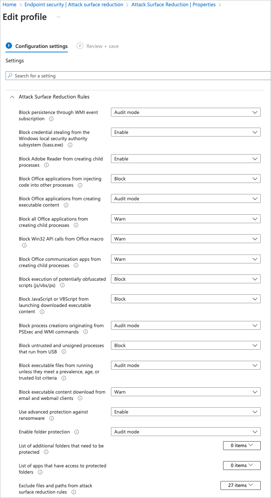
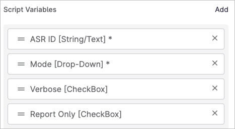

# Windows Defender ASR Rule Docs
Windows Defender Attack Surface Reduction rules, _which only work when Defender is the primary antivirus on a system,_ allow you to enforce or audit additional security rules that may cause problems but may also provide extra protection. These are generally configured via Intune policies, but the "Block abuse of exploited vulnerable signed drivers" rule is, currently, only available via registry or GPO or PowerShell and not in the "Configuration settings" of an Intune profile's GUI like many other ASR rules.

To that end, I assembled a quick script called [Set-MicrosoftASR-Rule.ps1](Set-MicrosoftASR-Rule.ps1) that (by default, can be overridden) sets the above rule to `Enable` (block) mode via PowerShell. It also reports on the state of any other ASR rules on a system by GUID, either using the `-ReportOnly` flag (makes no changes) or the `-Verbose` flag that reports on all while adjusting one.

You can set the value of any ASR GUID to `Enable`, `Disabled`, `AuditOnly`, or `Warn` modes by passing that text to the `-Mode` flag (`Enable` is the default), and you can pass in any `-ASRID` value you want, with the default being `56a863a9-875e-4185-98a7-b882c64b5ce5` (the vulnerable signed drivers block).

The Rule to GUID mappings from Microsoft for the rules are at: [https://learn.microsoft.com/en-us/microsoft-365/security/defender-endpoint/attack-surface-reduction-rules-reference?view=o365-worldwide#asr-rule-to-guid-matrix](https://learn.microsoft.com/en-us/microsoft-365/security/defender-endpoint/attack-surface-reduction-rules-reference?view=o365-worldwide#asr-rule-to-guid-matrix)

The details of the _Block abuse of vulnerable signed drivers_ rule are at [https://learn.microsoft.com/en-us/microsoft-365/security/defender-endpoint/attack-surface-reduction-rules-reference?view=o365-worldwide#block-abuse-of-exploited-vulnerable-signed-drivers](https://learn.microsoft.com/en-us/microsoft-365/security/defender-endpoint/attack-surface-reduction-rules-reference?view=o365-worldwide#block-abuse-of-exploited-vulnerable-signed-drivers)

Many rules are supported on Server and Workstations; you can determine which ones are supported on which systems here: [https://learn.microsoft.com/en-us/microsoft-365/security/defender-endpoint/attack-surface-reduction-rules-reference?view=o365-worldwide#asr-rules-supported-operating-systems](https://learn.microsoft.com/en-us/microsoft-365/security/defender-endpoint/attack-surface-reduction-rules-reference?view=o365-worldwide#asr-rules-supported-operating-systems)

All the above links are to anchors within the same long page.

The process for enabling ASR rules via PowerShell is documented at: [https://learn.microsoft.com/en-us/microsoft-365/security/defender-endpoint/enable-attack-surface-reduction?view=o365-worldwide#powershell](https://learn.microsoft.com/en-us/microsoft-365/security/defender-endpoint/enable-attack-surface-reduction?view=o365-worldwide#powershell) (which is used in this script).

I'm using this both as a Run once immediately script for all of my endpoints to update them as soon as they come online under management, as well as a run-weekly update to ensure compliance if any get changed, both from a NinjaRMM policy.

## Example Output
Here's what one machine on our system looks like in Report Only mode with the script, with "rule in question" being the driver one that the script is set to add:

Existing ASR Rule Value(s):
Rule 0 GUID: 01443614-cd74-433a-b99e-2ecdc07bfc25 is set to value Audit
Rule 1 GUID: 26190899-1602-49e8-8b27-eb1d0a1ce869 is set to value Warn
Rule 2 GUID: 3b576869-a4ec-4529-8536-b80a7769e899 is set to value Audit
Rule 3 GUID: 56a863a9-875e-4185-98a7-b882c64b5ce5 is set to value Block (RULE IN QUESTION)
Rule 4 GUID: 5beb7efe-fd9a-4556-801d-275e5ffc04cc is set to value Block
Rule 5 GUID: 75668c1f-73b5-4cf0-bb93-3ecf5cb7cc84 is set to value Block
Rule 6 GUID: 7674ba52-37eb-4a4f-a9a1-f0f9a1619a2c is set to value Block
Rule 7 GUID: 92e97fa1-2edf-4476-bdd6-9dd0b4dddc7b is set to value Warn
Rule 8 GUID: 9e6c4e1f-7d60-472f-ba1a-a39ef669e4b2 is set to value Block
Rule 9 GUID: b2b3f03d-6a65-4f7b-a9c7-1c7ef74a9ba4 is set to value Block
Rule 10 GUID: be9ba2d9-53ea-4cdc-84e5-9b1eeee46550 is set to value Warn
Rule 11 GUID: c1db55ab-c21a-4637-bb3f-a12568109d35 is set to value Block
Rule 12 GUID: d1e49aac-8f56-4280-b9ba-993a6d77406c is set to value Audit
Rule 13 GUID: d3e037e1-3eb8-44c8-a917-57927947596d is set to value Block
Rule 14 GUID: d4f940ab-401b-4efc-aadc-ad5f3c50688a is set to value Warn
Rule 15 GUID: e6db77e5-3df2-4cf1-b95a-636979351e5b is set to value Audit

In a perfect world you set all of them to block, but sometimes you run into user issues that require some tweaks.

In Intune, the settings above (minus the "rule in question" one set via PowerShell) look like this screenshot: 

## From NinjaRMM
This script works with Script Variables as well. See screenshot for the ones I have configured, which are:

- ASR ID [text] (default is `56a863a9-875e-4185-98a7-b882c64b5ce5`)
- Mode [Drop-down] with values ‘`Enable`’,’`Disabled`’,’`AuditMode`’,’`Warn`’ (`Enable` is default)
- Verbose [CheckBox] (default is `Checked`)
- Report Only [CheckBox] (default is `Unchecked`)

See script documentation at the top for parameters and usage examples.

## Policy Overrides
This should work if you're not in Intune but still Defender for Endpoint licensed, this should work still unless a policy overrides it. This Policy Conflict statement shows you what wins when you have multiple policies: [https://learn.microsoft.com/en-us/microsoft-365/security/defender-endpoint/enable-attack-surface-reduction?view=o365-worldwide#policy-conflict](https://learn.microsoft.com/en-us/microsoft-365/security/defender-endpoint/enable-attack-surface-reduction?view=o365-worldwide#policy-conflict)

Microsoft Defender for Endpoint has to be the PRIMARY antivirus for a device for ASR rules to work, though with EDR Enforce Mode there is a way for Defender to do a bit of enforcement even with another provider's EDR, but that's not entirely standard.

The desire of Microsoft to have you manually create a custom profile with OMA-URI setting per [https://learn.microsoft.com/en-us/microsoft-365/security/defender-endpoint/enable-attack-surface-reduction?view=o365-worldwide#custom-profile-in-intune](https://learn.microsoft.com/en-us/microsoft-365/security/defender-endpoint/enable-attack-surface-reduction?view=o365-worldwide#custom-profile-in-intune) to enable the "Block abuse of exploited vulnerable signed drivers" rule rather than just letting you select it from an Intune drop-down like the rest of them mostly are, and I didn't want to deal with that so I PowerShelled it. The other settings I actually have Intune-pushed, but you can use GPOs with the Microsoft Defender Antivirus area if you don't have Intune.